# 🏢 AssetDesk - Enterprise Asset Management System

<div align="center">


[](https://spring.io/projects/spring-boot)
[](https://angular.io/)
[](https://www.postgresql.org/)
[](https://openjdk.org/)

*A comprehensive enterprise solution for managing IT assets, requests, and service records*

</div>

## 📋 Table of Contents

- [🎯 Overview](#-overview)
- [🏗️ System Architecture](#️-system-architecture)
- [👥 User Roles & Permissions](#-user-roles--permissions)
- [🔄 Business Workflows](#-business-workflows)
- [🚀 Features](#-features)
- [🛠️ Technology Stack](#️-technology-stack)
- [📦 Installation & Setup](#-installation--setup)
- [🔧 Configuration](#-configuration)
- [📊 API Documentation](#-api-documentation)
- [🎨 Frontend Structure](#-frontend-structure)
- [📱 Usage Examples](#-usage-examples)
- [🔒 Security](#-security)
- [📈 Monitoring & Analytics](#-monitoring--analytics)
- [🤝 Contributing](#-contributing)

## 🎯 Overview

AssetDesk is a modern, full-stack enterprise asset management system designed to streamline IT asset lifecycle management, from procurement to retirement. Built with Spring Boot and Angular, it provides a comprehensive solution for organizations to track, manage, and optimize their IT resources.

### Key Capabilities
- 📊 **Asset Lifecycle Management** - Complete tracking from procurement to disposal
- 🎫 **Request Management** - Streamlined asset request and approval workflows
- 🔧 **Service Records** - Maintenance and service history tracking
- 📈 **Analytics & Reporting** - Real-time insights and comprehensive reports
- 🔔 **Smart Notifications** - Automated alerts for warranty expiry and maintenance
- 👥 **Multi-role Support** - Role-based access control for different user types

## 🏗️ System Architecture

```mermaid
graph TB
    subgraph "Frontend Layer"
        A[Angular 20 SPA]
        B[Angular Material UI]
        C[RxJS State Management]
    end
    
    subgraph "API Gateway"
        D[Spring Boot REST API]
        E[JWT Authentication]
        F[CORS Configuration]
    end
    
    subgraph "Business Logic"
        G[Service Layer]
        H[Repository Layer]
        I[Domain Models]
    end
    
    subgraph "Data Layer"
        J[PostgreSQL Database]
        K[JPA/Hibernate ORM]
        L[Connection Pooling]
    end
    
    subgraph "External Services"
        M[Email Notifications]
        N[File Storage]
        O[PDF Generation]
    end
    
    A --> D
    B --> A
    C --> A
    D --> G
    E --> D
    F --> D
    G --> H
    H --> I
    I --> K
    K --> J
    G --> M
    G --> N
    G --> O
    
    style A fill:#e1f5fe
    style D fill:#f3e5f5
    style G fill:#e8f5e8
    style J fill:#fff3e0
```



## 👥 User Roles & Permissions

### 🔵 Employee Role


**Permissions:**
- ✅ View assigned assets
- ✅ Create new asset requests
- ✅ Track request status
- ✅ Report asset issues
- ✅ View personal notifications
- ❌ Cannot manage other users' assets
- ❌ Cannot approve requests

### 🟢 IT Support Role


**Permissions:**
- ✅ All Employee permissions
- ✅ Manage asset inventory
- ✅ Approve/reject requests
- ✅ Allocate assets to users
- ✅ Create service records
- ✅ Manage vendors
- ✅ Generate reports
- ❌ Cannot manage users

### 🔴 Admin Role


**Permissions:**
- ✅ All IT Support permissions
- ✅ Create/manage users
- ✅ System configuration
- ✅ Advanced analytics
- ✅ Data export/import
- ✅ Audit logs access

## 🔄 Business Workflows

### Asset Request Workflow


### Issue Resolution Workflow


## 🚀 Features

### 📊 Asset Management
- **Comprehensive Asset Tracking**: Hardware, Software, and Accessories
- **Asset Categories**: Laptops, Desktops, Monitors, Printers, Software Licenses
- **Lifecycle Management**: From procurement to retirement
- **Warranty Tracking**: Automated expiry notifications
- **Depreciation Calculation**: Automatic asset value depreciation

### 🎫 Request Management
- **Multi-type Requests**: New, Replacement, Upgrade, Additional assets
- **Priority Levels**: Low, Medium, High, Urgent
- **Approval Workflow**: Multi-stage approval process
- **Status Tracking**: Real-time request status updates
- **Business Justification**: Required documentation for requests

### 🔧 Service & Maintenance
- **Service Records**: Complete maintenance history
- **Issue Tracking**: Bug reports and resolution tracking
- **Vendor Management**: Service provider information
- **Scheduled Maintenance**: Preventive maintenance scheduling
- **Cost Tracking**: Service and maintenance cost analysis

### 📈 Analytics & Reporting
- **Dashboard Insights**: Real-time system metrics
- **Asset Utilization**: Usage patterns and optimization
- **Cost Analysis**: Total cost of ownership tracking
- **Warranty Reports**: Upcoming expiry alerts
- **Custom Reports**: Flexible reporting system

## 🛠️ Technology Stack

### Backend Technologies
| Technology | Version | Purpose |
|------------|---------|---------|
|  | 21 | Core Programming Language |
|  | 3.5.5 | Application Framework |
|  | 6.x | Authentication & Authorization |
|  | Latest | Primary Database |
|  | 6.x | ORM Framework |
|  | 3.x | Build Tool |

### Frontend Technologies
| Technology | Version | Purpose |
|------------|---------|---------|
|  | 20.1.0 | Frontend Framework |
|  | 5.8.2 | Programming Language |
|  | 20.2.2 | UI Component Library |
|  | 7.8.0 | Reactive Programming |

### Additional Tools
- **JWT**: Token-based authentication
- **OpenPDF**: PDF report generation
- **Swagger**: API documentation
- **Lombok**: Code generation
- **H2**: Development database

## 📦 Installation & Setup

### Prerequisites
- ☕ Java 21 or higher
- 🐘 PostgreSQL 12 or higher
- 📦 Node.js 18 or higher
- 🅰️ Angular CLI 20.x

### Backend Setup

1. **Clone the repository**
```bash
git clone <repository-url>
cd AssetDesk/backend
```

2. **Configure Database**
```bash
# Create PostgreSQL database
createdb assetdesk

# Update application.properties with your database credentials
```

3. **Build and Run**
```bash
# Build the application
./mvnw clean install

# Run the application
./mvnw spring-boot:run
```

The backend will start on `http://localhost:8080`

### Frontend Setup

1. **Navigate to frontend directory**
```bash
cd AssetDesk/frontend
```

2. **Install dependencies**
```bash
npm install
```

3. **Start development server**
```bash
ng serve
```

The frontend will start on `http://localhost:4200`

### Docker Setup (Optional)

```bash
# Build and run with Docker Compose
docker-compose up -d
```

## 🔧 Configuration

### Database Configuration
```properties
# PostgreSQL Configuration
spring.datasource.url=jdbc:postgresql://localhost:5432/assetdesk
spring.datasource.username=postgres
spring.datasource.password=your_password

# JPA Configuration
spring.jpa.hibernate.ddl-auto=update
spring.jpa.show-sql=false
```

### JWT Configuration
```properties
# JWT Settings
jwt.secret=YOUR_SECRET_KEY
jwt.expiration=86400000  # 24 hours
```

### Frontend Environment
```typescript
// src/environments/environment.ts
export const environment = {
  production: false,
  apiUrl: 'http://localhost:8080/api'
};
```

## 📊 API Documentation

### Authentication Endpoints
```http
POST /api/auth/login
Content-Type: application/json

{
  "email": "user@example.com",
  "password": "password"
}
```

### Asset Management Endpoints
```http
# Get all assets
GET /api/assets

# Create new asset
POST /api/assets

# Get asset by ID
GET /api/assets/{id}

# Update asset
PUT /api/assets/{id}

# Delete asset
DELETE /api/assets/{id}
```

### Request Management Endpoints
```http
# Get user requests
GET /api/requests

# Create new request
POST /api/requests

# Approve request
PUT /api/requests/{id}/approve

# Reject request
PUT /api/requests/{id}/reject
```

**Swagger Documentation**: Available at `http://localhost:8080/swagger-ui.html`

## 🎨 Frontend Structure

```
src/app/
├── core/                    # Core functionality
│   ├── guards/             # Route guards
│   ├── interceptors/       # HTTP interceptors
│   ├── models/            # TypeScript interfaces
│   ├── services/          # Core services
│   └── utils/             # Utility functions
├── features/              # Feature modules
│   ├── assets/           # Asset management
│   ├── auth/             # Authentication
│   ├── dashboard/        # Dashboard
│   ├── issues/           # Issue tracking
│   ├── users/            # User management
│   └── vendors/          # Vendor management
├── layout/               # Layout components
├── shared/               # Shared components
│   ├── components/       # Reusable components
│   ├── pipes/           # Custom pipes
│   └── ui/              # UI components
└── styles/              # Global styles
```

## 📱 Usage Examples

### Creating an Asset Request

1. **Employee Login**
```typescript
// Login with employee credentials
const loginData = {
  email: 'employee@company.com',
  password: 'password'
};
```

2. **Navigate to Requests**
```typescript
// Route: /requests/new
// Fill out the request form
const requestData = {
  requestType: 'NEW_ASSET',
  category: 'HARDWARE',
  assetType: 'LAPTOP',
  assetName: 'Development Laptop',
  businessJustification: 'Required for software development tasks',
  priority: 'HIGH'
};
```

3. **Submit Request**
```typescript
// Request is submitted for IT Support approval
// Employee receives notification of submission
```

### Asset Allocation Process

1. **IT Support Review**
```typescript
// IT Support logs in and reviews pending requests
// Route: /requests
// Filter by status: PENDING
```

2. **Approve Request**
```typescript
// Click approve button
// Add remarks if necessary
// Request status changes to APPROVED
```

3. **Allocate Asset**
```typescript
// Navigate to asset allocation
// Route: /assets/allocate
// Select approved request
// Choose available asset
// Complete allocation
```

### Reporting an Issue

1. **Employee Reports Issue**
```typescript
const issueData = {
  assetId: 123,
  issueType: 'HARDWARE',
  priority: 'MEDIUM',
  description: 'Laptop screen flickering intermittently',
  stepsToReproduce: '1. Open laptop 2. Use for 30 minutes 3. Screen starts flickering'
};
```

2. **IT Support Response**
```typescript
// IT Support receives notification
// Reviews issue details
// Assigns priority and creates service record if needed
```

## 🔒 Security

### Authentication & Authorization
- **JWT Token-based Authentication**: Secure stateless authentication
- **Role-based Access Control**: Granular permissions per user role
- **Password Encryption**: BCrypt hashing for password security
- **CORS Configuration**: Controlled cross-origin resource sharing

### Security Headers
```java
// Security configuration includes:
// - CSRF protection
// - XSS protection
// - Content Security Policy
// - Secure session management
```

### API Security
- **Input Validation**: Comprehensive request validation
- **SQL Injection Prevention**: Parameterized queries
- **Rate Limiting**: API call throttling
- **Audit Logging**: Complete action tracking

## 📈 Monitoring & Analytics

### Dashboard Metrics
- 📊 **Total Assets**: Real-time asset count
- 🎫 **Pending Requests**: Outstanding request count
- ⚠️ **Active Issues**: Current issue count
- 📅 **Warranty Expiry**: Upcoming expiry alerts

### Reports Available
- **Asset Inventory Report**: Complete asset listing
- **Allocation History**: Asset assignment tracking
- **Cost Analysis Report**: Financial insights
- **Maintenance Report**: Service history
- **User Activity Report**: Usage analytics

### Real-time Notifications
- 🔔 **Warranty Expiry Alerts**: 30, 15, 7 days before expiry
- 📧 **Request Status Updates**: Approval/rejection notifications
- ⚡ **Issue Assignments**: New issue notifications
- 📊 **System Alerts**: Critical system notifications

## 🤝 Contributing

### Development Workflow
1. **Fork the repository**
2. **Create feature branch**: `git checkout -b feature/amazing-feature`
3. **Commit changes**: `git commit -m 'Add amazing feature'`
4. **Push to branch**: `git push origin feature/amazing-feature`
5. **Open Pull Request**

### Code Standards
- **Backend**: Follow Spring Boot best practices
- **Frontend**: Follow Angular style guide
- **Testing**: Maintain test coverage above 80%
- **Documentation**: Update README for new features

### Development Setup
```bash
# Backend development
./mvnw spring-boot:run -Dspring-boot.run.profiles=dev

# Frontend development
ng serve --configuration=development

# Run tests
./mvnw test  # Backend tests
ng test      # Frontend tests
```

---

<div align="center">


*AssetDesk - Streamlining IT Asset Management for Modern Enterprises*

</div>